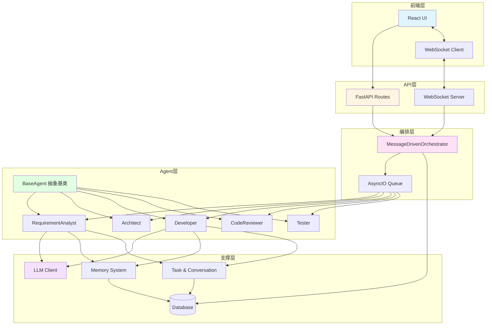
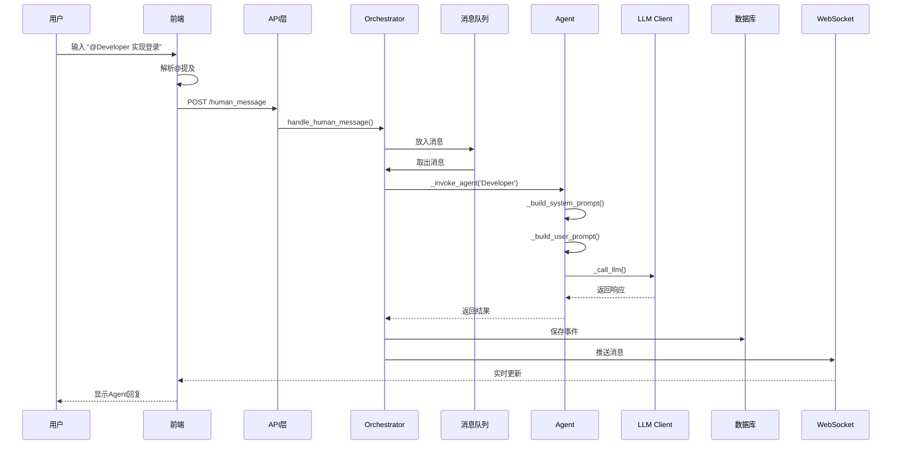
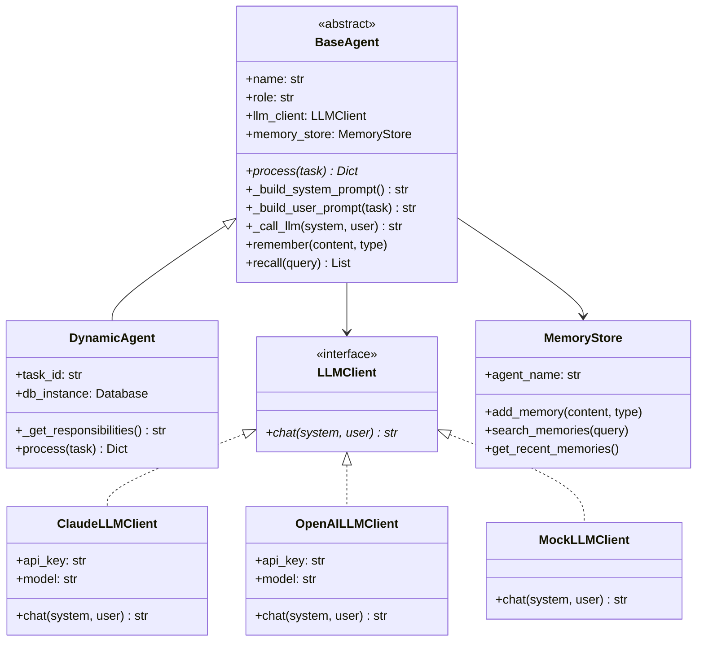
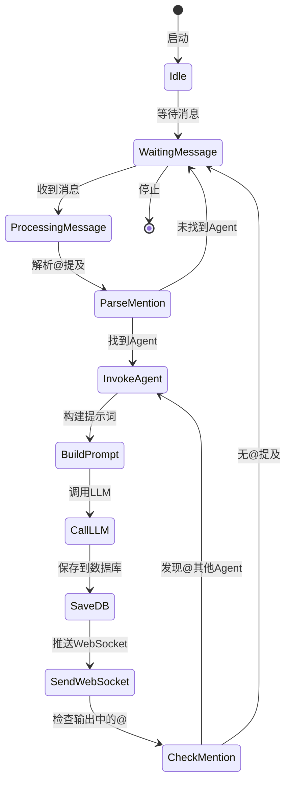
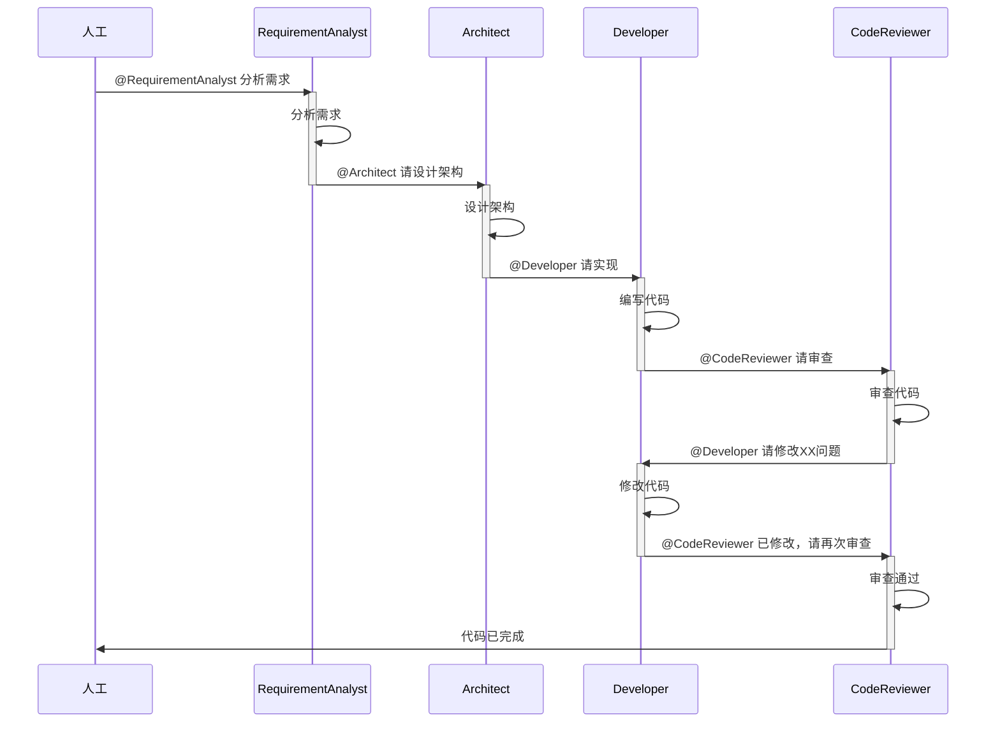
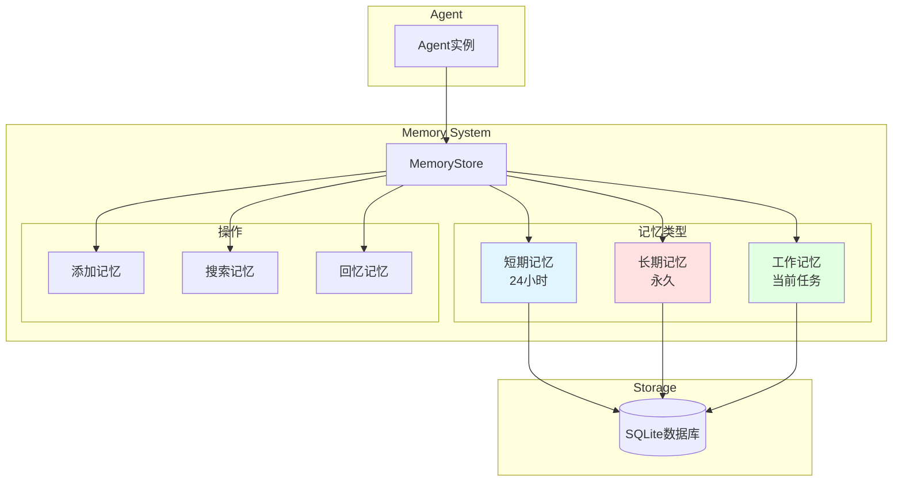
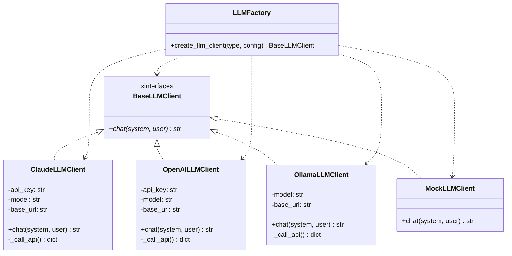
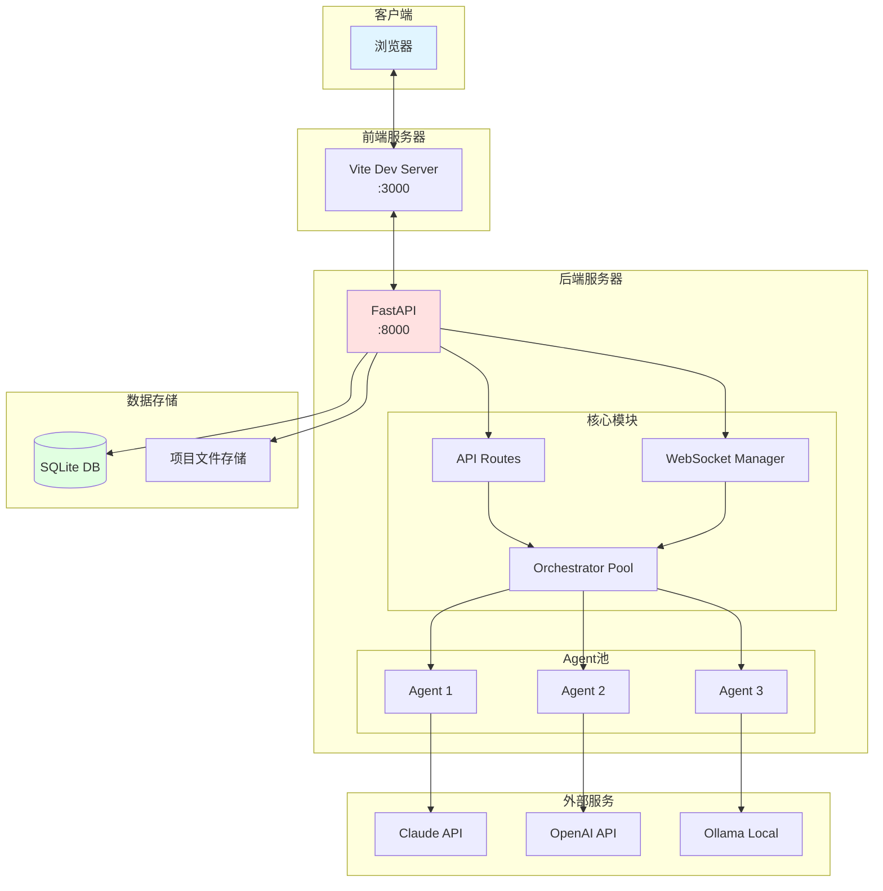

# Agent模块架构图

## 1. 整体架构分层图



## 2. 消息驱动工作流



## 3. Agent内部结构



## 4. Orchestrator工作流程



## 5. 数据流图

```mermaid
flowchart LR
    subgraph Input
        A[用户输入]
        B[@提及解析]
    end
    
    subgraph Processing
        C[消息队列]
        D[Agent处理]
        E[LLM调用]
    end
    
    subgraph Output
        F[数据库存储]
        G[WebSocket推送]
        H[前端显示]
    end
    
    A --> B
    B --> C
    C --> D
    D --> E
    E --> D
    D --> F
    D --> G
    F --> H
    G --> H
    
    style A fill:#e1f5ff
    style E fill:#ffe1e1
    style H fill:#e1ffe1
```

## 6. Agent协作流程



## 7. 记忆系统架构



## 8. LLM适配器模式



## 9. 完整的请求响应流程

```mermaid
flowchart TD
    Start([用户发送消息]) --> Parse[解析@提及]
    Parse --> API[API接收请求]
    API --> Auth{权限验证}
    Auth -->|失败| Error1[返回403]
    Auth -->|成功| FindOrch{查找Orchestrator}
    
    FindOrch -->|不存在| StartOrch[启动新Orchestrator]
    FindOrch -->|已存在| UseOrch[使用现有Orchestrator]
    
    StartOrch --> Queue[放入消息队列]
    UseOrch --> Queue
    
    Queue --> Dequeue[从队列取出]
    Dequeue --> FindAgent{查找Agent}
    
    FindAgent -->|不存在| Error2[返回错误]
    FindAgent -->|存在| InvokeAgent[调用Agent]
    
    InvokeAgent --> BuildSysPrompt[构建系统提示词]
    BuildSysPrompt --> BuildUserPrompt[构建用户提示词]
    BuildUserPrompt --> CallLLM[调用LLM]
    
    CallLLM --> LLMSuccess{调用成功?}
    LLMSuccess -->|失败| Error3[返回LLM错误]
    LLMSuccess -->|成功| SaveDB[保存到数据库]
    
    SaveDB --> SendWS[推送WebSocket]
    SendWS --> CheckMention{检查@提及}
    
    CheckMention -->|有| Queue
    CheckMention -->|无| End([结束])
    
    Error1 --> End
    Error2 --> End
    Error3 --> End
    
    style Start fill:#e1f5ff
    style CallLLM fill:#ffe1e1
    style End fill:#e1ffe1
    style Error1 fill:#ffcccc
    style Error2 fill:#ffcccc
    style Error3 fill:#ffcccc
```

## 10. 部署架构


